<a id="top"></a>
# DADS-5001 Mini-Project
# วิเคราะห์ข้อมูลผู้สำเร็จการศึกษาและภาวะหางานทำของบัณฑิต มหาวิทยาลัยเกษตรศาสตร์

Data Source: https://web.planning.ku.ac.th/Download/work/work_index.htm

Member:
<br>6720422003 อาทิตยา พุทธโอวาท
<br>6720422020 สุพิชฌาย์ แก้วเปล่งศรีสกุล
<br>6720422030 นพวัฒน์ โชคสุนทรเลิศ

# Content

[Part 1: Preprocessing & Cleansing](#part1)

[Part 2: Data Analysis](#part2)

[Part 3: Summary](#part3)

[Reference](#reference)

[Challenge](#challenge)

<a id="part1"></a>
# Part 1 : Preprocessing & Cleansing

## 1.1 Preprocessing

จากภาพที่ 1-1 คือไฟล์ Excel ที่ Download มา จะเห็นได้ว่ายังไม่พร้อมสำหรับการวิเคราะห์ทันที จากตัวอย่างพบปัญหาหลัก 2 ประเด็น

<table align="center">
  <tr>
    <td align="center">
      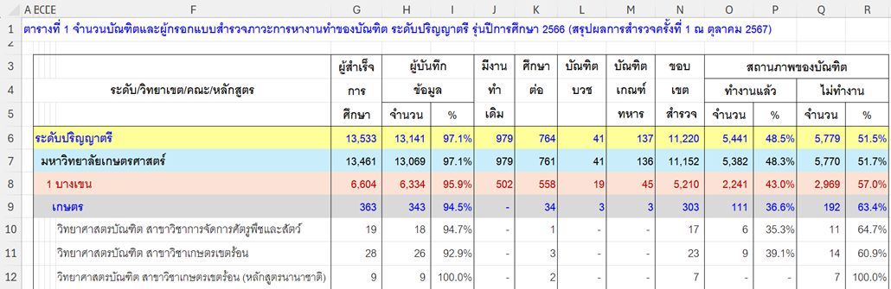<br>
      <em>ภาพที่ 1-1 ภาพตัวอย่างข้อมูลก่อน Cleansing</em>
    </td>
  </tr>
</table>

1. มีการ **Merge** ที่แถวหัวคอลัมน์ (Column Header)
2. มีแถว **สรุปรวมยอด (Total)** ปะปนอยู่ในข้อมูลดิบ

### แนวทางการแก้ไข

1. **กำหนดชื่อคอลัมน์ใหม่** ให้ชัดเจนใน Excel (ยกเลิก/แก้ไขเซลล์จากการ Merge)

   ```python
   df = pd.read_excel(file_path, header=None)
   # กำหนดชื่อให้ Column
   [
       ('วิทยาเขต', 'D'),
       ('คณะ', 'E'),
       ('ภาค', None),
       ('สาขา', 'F'),
       ('ผู้สำเร็จการศึกษา', 'G'),
       ('ผู้บันทึกข้อมูล', 'H'),
       ('มีงานทำเดิม', 'J'),
       ('ขอบเขตสำรวจ', 'N')
   ]
   ```

2. **คัดเลือกแถวข้อมูล** ที่ต้องนำเข้า DataFrame โดยอ้างอิงจากคอลัมน์ “สาขา” เป็นเกณฑ์

    ```python
    df['keep'] = np.select([df["สาขา"].isna()], [0], 1)
    df.ffill(inplace=True)
    df = df[df["keep"] == 1]
    df.drop(columns=['keep'], inplace=True)
    ```

## 1.2 Cleansing
- **ตัดแถวที่เป็นส่วนน้อย/ผิดปกติ** ที่ไม่กระทบผลวิเคราะห์ เช่น วิทยาเขตที่มีจำนวนน้อยมาก (อาจเกิดจากข้อมูลผิดพลาดหรือมีข้อมูลน้อยจริง)

  วิทยาเขตที่มีจำนวนน้อย สาเหตุมาจากข้อมูลอาจจะ Error หรือ ข้อมูลน้อยจริงๆ

  ```python
  # original 4354
  df[['วิทยาเขต', 'ปี']].groupby('วิทยาเขต', dropna=False).count().sort_values('ปี')
  ```
  <table border="1">
    <thead>
      <tr>
        <th>วิทยาเขต</th>
        <th>ปี</th>
      </tr>
    </thead>
    <tbody>
      <tr>
        <th>ปริญญาโท</th>
        <td>1</td>
      </tr>
      <tr>
        <th>5. โครงการจัดตั้งวิทยาเขตสุพรรณบุรี</th>
        <td>2</td>
      </tr>
      <tr>
        <th>5.โครงการจัดตั้งวิทยาเขตสุพรรณบุรี</th>
        <td>3</td>
      </tr>
      <tr>
        <th>สถาบันสมทบ</th>
        <td>4</td>
      </tr>
      <tr>
        <th>5 สุพรรณบุรี</th>
        <td>6</td>
      </tr>
      <tr>
        <th>4.เฉลิมพระเกียรติ จังหวัดสกลนคร</th>
        <td>31</td>
      </tr>
      <tr>
        <th>3.ศรีราชา</th>
        <td>32</td>
      </tr>
      <tr>
        <th>2.กำแพงแสน</th>
        <td>71</td>
      </tr>
      <tr>
        <th>4 เฉลิมพระเกียรติ จังหวัดสกลนคร</th>
        <td>114</td>
      </tr>
      <tr>
        <th>3 ศรีราชา</th>
        <td>126</td>
      </tr>
      <tr>
        <th>4. เฉลิมพระเกียรติ จังหวัดสกลนคร</th>
        <td>136</td>
      </tr>
      <tr>
        <th>3. ศรีราชา</th>
        <td>185</td>
      </tr>
      <tr>
        <th>1.บางเขน</th>
        <td>279</td>
      </tr>
      <tr>
        <th>2 กำแพงแสน</th>
        <td>304</td>
      </tr>
      <tr>
        <th>2. กำแพงแสน</th>
        <td>396</td>
      </tr>
      <tr>
        <th>1 บางเขน</th>
        <td>1118</td>
      </tr>
      <tr>
        <th>1. บางเขน</th>
        <td>1546</td>
      </tr>
    </tbody>
  </table>
  
  ```python
  value_to_drop = [
      'ปริญญาโท',
      '5. โครงการจัดตั้งวิทยาเขตสุพรรณบุรี',
      '5.โครงการจัดตั้งวิทยาเขตสุพรรณบุรี',
      'สถาบันสมทบ',
      '5 สุพรรณบุรี',
  ]
  df = df[~df['วิทยาเขต'].isin(value_to_drop)]
  df.shape
  # (4338, 30)
  ```
- ทำ **Data Standardization** (การทำข้อความที่พิมพ์ไม่เหมือนกัน ให้เป็นอันเดียวกัน)

  <table style="border-collapse: collapse; width: 100%; font-family: Arial, sans-serif;">
    <thead>
      <tr>
      <th style="text-align: center;">ก่อนทำ</th>
      <th style="text-align: center;">หลังทำ</th>
      </tr>
    </thead>
  <tbody>
  <tr>
  <td>

  ```python
  df['วิทยาเขต'].unique()
  ```
  </td>
  <td>

  ```python
  df['วิทยาเขต'] = (
      df['วิทยาเขต']
      .astype(str)
      .str.replace(". ", ".", regex=False)
      .str.replace(" ", ".", regex=False)
      .apply(lambda x: re.sub(r'^[0-9]\.\s*', '', x))
      .str.replace(".", " ", regex=False)
  )
  df['วิทยาเขต'].unique()
  ```
  </td>
  </tr>
  <tr>
  <td>

  ```python
  array(['1. บางเขน', '2. กำแพงแสน', '3. ศรีราชา',
      '4. เฉลิมพระเกียรติ จังหวัดสกลนคร', '1 บางเขน', '2 กำแพงแสน',
      '3 ศรีราชา', '4 เฉลิมพระเกียรติ จังหวัดสกลนคร', '1.บางเขน',
      '2.กำแพงแสน', '3.ศรีราชา', '4.เฉลิมพระเกียรติ จังหวัดสกลนคร'],
    dtype=object)
  ```
  </td>
  <td>

  ```python
  array(['บางเขน', 'กำแพงแสน', 'ศรีราชา', 'เฉลิมพระเกียรติ จังหวัดสกลนคร'],
      dtype=object)
  ```
  </td>
  </tr>
  </tbody>
  </table>

- เติม **Missing value**

  ```python
  df['ภาค'] = (
    df['ภาค']
    .str.replace(" ", "")
  )
  df[['ภาค', 'ปี']].groupby('ภาค', dropna=False).count().sort_values('ปี')
  # ภาค	     ปี
  # ภาคพิเศษ	432
  # ภาคปกติ    1012
  # NaN	    2894
  ```
  
  ```python
  df['ภาค'] = df['ภาค'].fillna('ภาคปกติ')
  df[['ภาค', 'ปี']].groupby('ภาค', dropna=False).count().sort_values('ปี')
  # ภาค	     ปี
  # ภาคพิเศษ	432
  # ภาคปกติ	3906
  ```

- จากตารางที่ 1-1 สำรวจเบื้องต้น พบว่านักศึกษาระดับ **สูงกว่าปริญญาตรี** ส่วนใหญ่มักมีงานทำอยู่แล้ว จึง **ไม่นำกลุ่มนี้มาวิเคราะห์อัตราการได้งาน** และจะเลือกใช้ **เฉพาะข้อมูลระดับปริญญาตรี** สำหรับการวิเคราะห์หลักเท่านั้น
  
<table align="center">
  <tr>
    <td align="center">
      <br>
      <em>ตารางที่ 1-1 แสดงข้อมูลผู้มีงานเดิม</em>
    </td>
  </tr>
</table>


<a id="part2"></a>
# Part 2 : Data Analysis

## 2.1 ภาวะการได้งานของบัณฑิตไทย: จุดอ่อนที่ควรจับตาในมหาวิทยาลัยเกษตรศาสตร์

ข้อมูลภาวะการมีงานทำของบัณฑิตระดับอุดมศึกษาทั่วประเทศเผยให้เห็นภาพรวมของความพร้อมในการเข้าสู่ตลาดแรงงานของนักศึกษาไทย โดยเฉพาะเมื่อเปรียบเทียบระหว่างมหาวิทยาลัยชั้นนำ จากกราฟที่ 2-1 จะเห็นได้ว่ามหาวิทยาลัยเกษตรศาสตร์มีอัตราการได้งานของบัณฑิตที่ต่ำที่สุดในกลุ่ม ซึ่งสะท้อนถึงความท้าทายเชิงโครงสร้างในการเชื่อมโยงการศึกษาเข้ากับความต้องการของตลาดแรงงาน

ข้อมูลนี้จึงเป็นจุดตั้งต้นสำคัญในการวิเคราะห์เชิงลึก เพื่อพัฒนาแนวทางการปรับปรุงหลักสูตร การแนะแนวอาชีพ และการสร้างความร่วมมือกับภาคธุรกิจในอนาคต

<table align="center">
  <tr>
    <td align="center">
      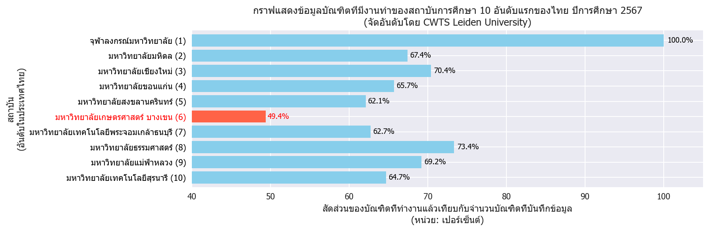<br>
      <em>กราฟที่ 2-1 แสดงข้อมูลบัณฑิตที่มีงานทำของสถาบันการศึกษา 10 อันดับแรกของไทย</em>
    </td>
  </tr>
</table>

## 2.2 การวิเคราะห์ข้อมูลภาวะการได้งานของบัณฑิต พ.ศ. 2557–2566

การศึกษาครั้งนี้มุ่งเน้นการวิเคราะห์ข้อมูลภาวะการได้งานของบัณฑิตจากมหาวิทยาลัยเกษตรศาสตร์ในช่วงระยะเวลา 10 ปี ตั้งแต่ปี พ.ศ. 2557 ถึง พ.ศ. 2566 โดยครอบคลุมทุกระดับการศึกษา ทั้งระดับปริญญาตรี โท และเอก (แต่ในบทความนี้จะเน้นเฉพาะบัณฑิตที่จบการศึกษาในระดับปริญญาตรี)

จากกราฟที่ 2-2 พบว่า บัณฑิตของมหาวิทยาลัยมีการบันทึกข้อมูลภาวะการได้งานอย่างต่อเนื่องและมีความครบถ้วน โดยมีอัตราการบันทึกข้อมูลเฉลี่ยอยู่ที่ 89.26% ตลอดช่วงเวลาที่ศึกษา ซึ่งสะท้อนถึงความร่วมมือระหว่างบัณฑิตและหน่วยงานภายในมหาวิทยาลัยในการติดตามผลการจ้างงานหลังสำเร็จการศึกษา

<table align="center">
  <tr>
    <td align="center">
      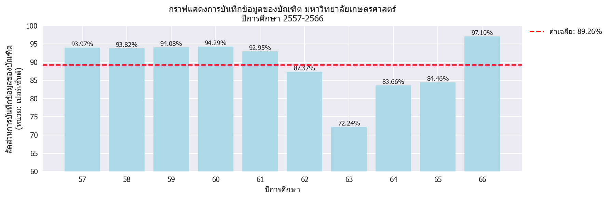<br>
      <em>กราฟที่ 2-2 แสดงการบันทึกข้อมูลของบัณฑิต มหาวิทยาลัยเกษตรศาสตร์</em>
    </td>
  </tr>
</table>

---
เมื่อจำแนกสถานภาพการทำงานออกเป็น 3 กลุ่มหลักจากกราฟที่ 2-3 แสดงให้เห็นว่า **สัดส่วนของบัณฑิตที่ยังไม่ได้ทำงานสูงมาก เฉลี่ย 53.50%** โดยมีแนวโน้มใกล้เคียงกับกลุ่มที่มีงานทำ คิดเป็น**เฉลี่ย 42.10%** ซึ่งถือเป็นประเด็นที่ควรให้ความสนใจ เนื่องจากสะท้อนถึงความท้าทายในการเข้าสู่ตลาดแรงงานของบัณฑิตในช่วงเวลานั้น

<table align="center">
  <tr>
    <td align="center">
      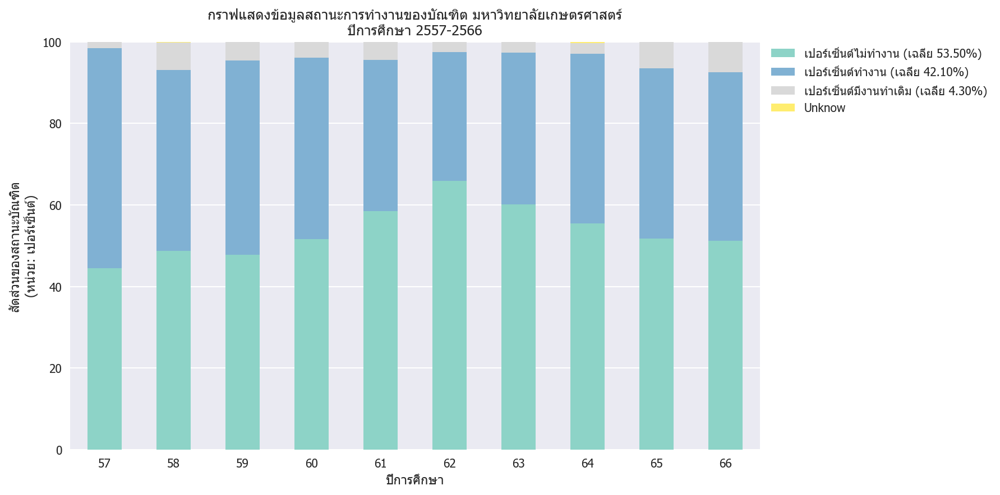<br>
      <em>กราฟที่ 2-3 กราฟแสดงข้อมูลสถานะการทำงานของบัณฑิต  มหาวิทยาลัยเกษตรศาสตร์</em>
    </td>
  </tr>
</table>

---
จากการสำรวจกลุ่มบัณฑิตที่ยังไม่ได้เข้าสู่ตลาดแรงงาน ดังแสดงในกราฟที่ 2-4 พบว่าเหตุผลหลักที่ยังไม่ทำงานคือ **“รอผลการสมัครงาน”** คิดเป็น 32.20% รองลงมาคือ **“ไม่ประสงค์จะทำงาน”** 26.70% ซึ่งทั้งสองเหตุผลมีสัดส่วนใกล้เคียงกัน สะท้อนถึงความไม่แน่นอนในกระบวนการเข้าสู่การจ้างงาน และความหลากหลายของแรงจูงใจส่วนบุคคล

<table align="center">
  <tr>
    <td align="center">
      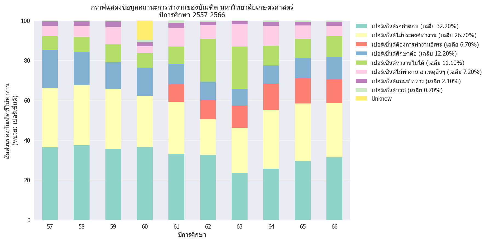<br>
      <em>กราฟที่ 2-4 กราฟแสดงรายละเอียดการไม่ทำงานของบัณฑิต มหาวิทยาลัยเกษตรศาสตร์</em>
    </td>
  </tr>
</table>

---
การศึกษาข้อมูลเชิงเปรียบเทียบรายคณะในช่วงปีการศึกษา 2564–2566 มุ่งเน้นการวิเคราะห์ 3 มิติหลัก ดังที่แสดงในกราฟที่ 2-5.1 และ 2-5.2 ได้แก่:
- รายได้เฉลี่ยของบัณฑิตจบใหม่
พบว่า บัณฑิตที่สำเร็จการศึกษาในช่วงเวลาดังกล่าวมีรายได้เฉลี่ยอยู่ที่ 18,935 บาทต่อเดือน ซึ่งสะท้อนถึงระดับค่าตอบแทนเริ่มต้นในตลาดแรงงานสำหรับผู้จบใหม่ โดยอาจมีความแตกต่างตามสาขาวิชาและกลุ่มธุรกิจที่เกี่ยวข้อง
- สัดส่วนการทำงานตรงสาขาวิชา
จากข้อมูลพบว่า สัดส่วนของบัณฑิตที่ประกอบอาชีพตรงตามสาขาวิชาที่เรียน คือ 66.23%
- จำนวนบัณฑิตในแต่ละคณะ

การพิจารณาจำนวนผู้สำเร็จการศึกษาในแต่ละคณะช่วยให้สามารถประเมินความหนาแน่นของกำลังคนในแต่ละสาขา และวิเคราะห์ความอิ่มตัวของตลาดแรงงานในบางกลุ่มวิชา


<table align="center">
  <tr>
    <td align="center">
      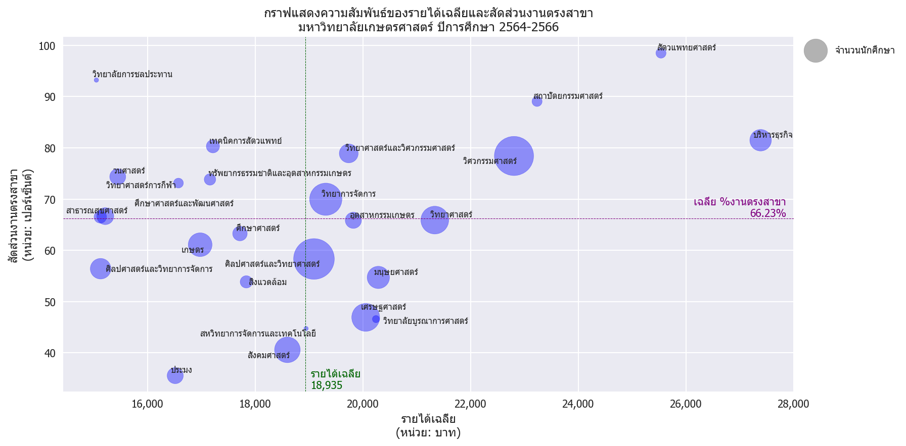<br>
      <em>กราฟที่ 2-5.1  กราฟแสดงรายได้เฉลี่ยแบ่งตามคณะ สูงสุด 12 อันดับแรก<br>มหาวิทยาลัยเกษตรศาสตร์ ปีการศึกษา 2564-2566</em>
    </td>
  </tr>
</table>

<table align="center">
  <tr>
    <td align="center">
      <br>
      <em>กราฟที่ 2-5.2 กราฟแสดงความสัมพันธ์ของรายได้เฉลี่ยและสัดส่วนงานตรงสาขา<br>มหาวิทยาลัยเกษตรศาสตร์ ปีการศึกษา 2564-2566</em>
    </td>
  </tr>
</table>

---
## 2.3 การจัดกลุ่มคณะตามกลุ่มธุรกิจเพื่อการวิเคราะห์ตลาดแรงงาน

เพื่อให้การวิเคราะห์สถานภาพการมีงานทำของบัณฑิตมีความชัดเจนและสามารถเปรียบเทียบข้ามสาขาได้อย่างมีระบบ จึงได้มีการจัดกลุ่มคณะและสาขาวิชาตามลักษณะของ กลุ่มธุรกิจ โดยแบ่งออกเป็นทั้งหมด 35 กลุ่มธุรกิจ อ้างอิงจากกราฟที่ 2-6 ซึ่งแสดงการเปรียบเทียบระหว่าง:
- สัดส่วนบัณฑิตที่ทำงานตรงตามสาขาวิชาที่เรียน
- สัดส่วนบัณฑิตที่หางานไม่ได้

<table align="center">
  <tr>
    <td align="center">
      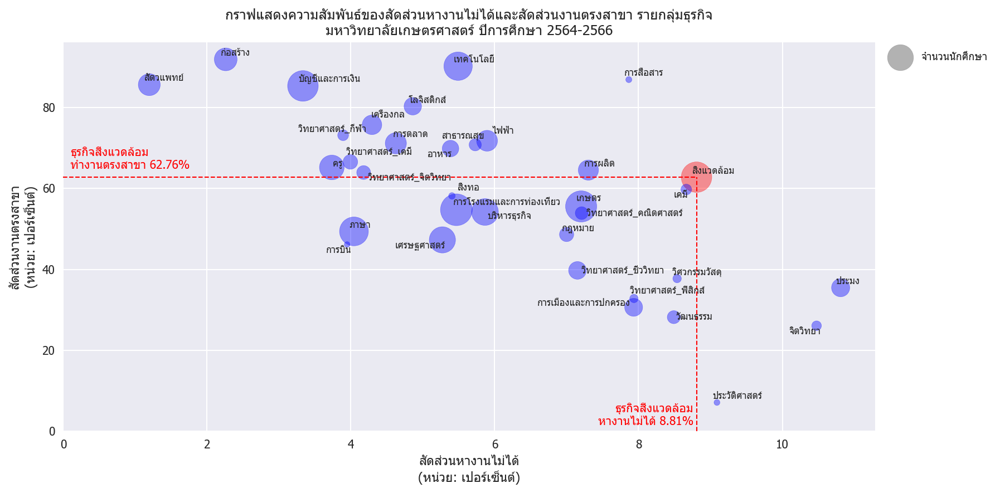<br>
      <em>กราฟที่ 2-6 แสดงความสัมพันธ์ของสัดส่วนหางานไม่ได้และสัดส่วนงานตรงสาขา มหาวิทยาลัยเกษตรศาสตร์</em>
    </td>
  </tr>
</table>

---
เมื่อกลุ่มวิจัยได้ดำเนินการวิเคราะห์เชิงลึกในกลุ่มธุรกิจด้านสิ่งแวดล้อม โดยอ้างอิงตารางที่ 2-1 พบว่า คณะวิศวกรรมศาสตร์บัณฑิต สาขาวิศวกรรมสิ่งแวดล้อม เป็นสาขาที่มี สัดส่วนบัณฑิตที่ยังไม่สามารถเข้าสู่ตลาดแรงงานได้สูงที่สุด โดยอยู่ที่ 8.62%

<table align="center">
  <tr>
    <td align="center">
      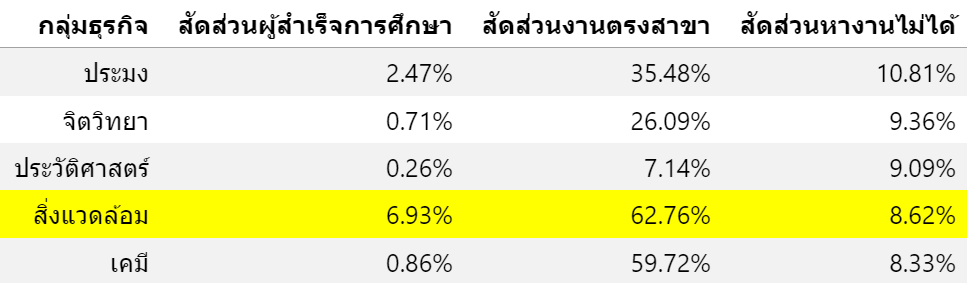<br>
      <em>ตารางที่ 2-1 แสดงเปรียบเทียบสัดส่วนงานตรงสาขากับสัดส่วนผู้สำเร็จการศึกษา Top5 มหาวิทยาลัยเกษตรศาสตร์</em>
    </td>
  </tr>
</table>

และเมื่อพิจารณาในรายคณะสาขาก็พบว่าคณะวิศวกรรมมีสัดส่วนหางานไม่ได้ในสัดส่วนที่ค่อนข้างสูง ดังแสดงในกราฟที่ 2-7

ตามรายงาน Future of Jobs 2025 โดย World Economic Forum (WEF) ร่วมกับจุฬาลงกรณ์มหาวิทยาลัย ได้ระบุว่า:
“การเปลี่ยนแปลงด้านสิ่งแวดล้อม เช่น การลดผลกระทบจากสภาพภูมิอากาศ จะกระตุ้นความต้องการ วิศวกรสิ่งแวดล้อม และผู้เชี่ยวชาญด้านพลังงานหมุนเวียน”

จากการวิเคราะห์ข้อมูล พบว่า กลุ่มธุรกิจด้านสิ่งแวดล้อม เป็นหนึ่งในกลุ่มที่มีจำนวนผู้สำเร็จการศึกษาสูง แต่กลับมี สัดส่วนการหางานไม่ได้ในระดับสูงอย่างมีนัยสำคัญ ซึ่งสวนทางกับแนวโน้มของตลาดแรงงานโลกที่กำลังให้ความสำคัญกับความยั่งยืนและการพัฒนาเศรษฐกิจสีเขียว

เมื่อกลุ่มวิจัยได้ดำเนินการวิเคราะห์เชิงลึกในกลุ่มธุรกิจด้านสิ่งแวดล้อม โดยอ้างอิงจากกราฟที่ 2-7 พบว่า คณะวิศวกรรมศาสตร์บัณฑิต สาขาวิศวกรรมสิ่งแวดล้อม เป็นสาขาที่มี สัดส่วนบัณฑิตที่ยังไม่สามารถเข้าสู่ตลาดแรงงานได้สูงที่สุด โดยอยู่ที่ 16.2%

<table align="center">
  <tr>
    <td align="center">
      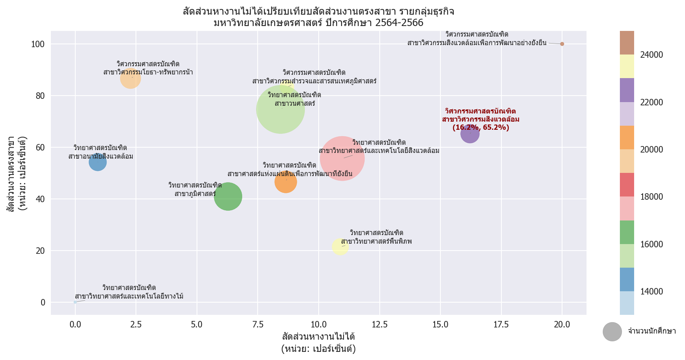<br>
      <em>กราฟที่ 2-7 แสดง Bubble plot เปรียบเทียบสัดส่วนงานตรงสาขา, สัดส่วนบัณฑิตหางานไม่ได้ และจำนวนบัณฑิต<br>กลุ่มธุรกิจสิ่งแวดล้อม รายคณะ ปีการศึกษา 2564-2565</em>
    </td>
  </tr>
</table>

---

<a id="part3"></a>
# Part 3 : Summary

จากการวิเคราะห์ข้อมูลข้างต้น เป็นจุดเริ่มต้นให้กลุ่มวิจัยสนใจประเด็นนี้เป็นพิเศษ โดยเฉพาะเมื่อพบว่า สาขาในกลุ่มธุรกิจสิ่งแวดล้อมมีการผลิตบัณฑิตในจำนวนมาก แต่กลับมีอัตราการว่างงานสูง ซึ่งสะท้อนถึงความไม่สมดุลระหว่างการผลิตบุคลากรกับความต้องการของตลาดแรงงานในประเทศที่เพิ่มขึ้นดังภาพที่ 3-1

เมื่อเปรียบเทียบกับอัตราการเติบโตของแต่ละประเภทอุตสาหกรรม (อ้างอิงจากรายงานผลการวิเคราะห์ข้อมูล อุปสงค์และอุปทานแรงงาน ระดับประเทศ ปี 2567) ดังแสดงในตารางที่ 3-1 พบว่า อุตสาหกรรมที่เกี่ยวข้องกับการจัดการน้ำ บำบัดน้ำเสีย และการจัดการสิ่งปฏิกูล มีอัตราการเติบโตสูงถึง ร้อยละ 2.4 ซึ่งถือว่าเป็นอัตราที่สูงกว่าหลายอุตสาหกรรมอื่นในช่วงเวลาเดียวกัน

ข้อมูลดังกล่าวสะท้อนถึงแนวโน้มการขยายตัวของภาคอุตสาหกรรมที่เกี่ยวข้องกับสิ่งแวดล้อมและการจัดการทรัพยากรอย่างยั่งยืน ซึ่งควรจะส่งผลให้เกิดความต้องการแรงงานในสาขาที่เกี่ยวข้อง เช่น วิศวกรรมสิ่งแวดล้อม อย่างต่อเนื่อง อย่างไรก็ตาม เมื่อพิจารณาร่วมกับข้อมูลการหางานของบัณฑิตในสาขานี้ กลับพบว่ามีสัดส่วนการหางานไม่ได้ในระดับสูง จึงเป็นประเด็นที่ควรได้รับการวิเคราะห์เพิ่มเติมถึงสาเหตุของความไม่สอดคล้องระหว่างการเติบโตของอุตสาหกรรมกับการจ้างงานจริง

<table align="center">
  <tr>
    <td align="center">
      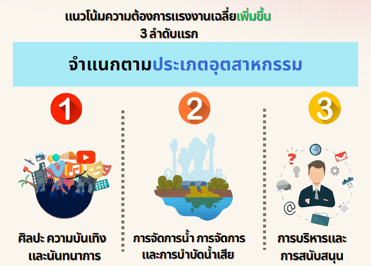<br>
      <em>ภาพที่ 3-1 อุตสาหกรรมที่มีแนวโน้มต้องการแรงงานเพิ่มขึ้น 3 อันดับแรก</em>
    </td>
  </tr>
</table>

<table align="center">
  <tr>
    <td align="center">
      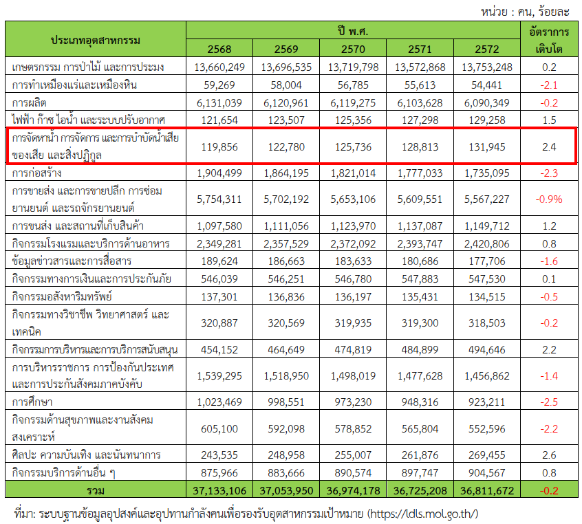<br>
      <em>ตารางที่ 3-1  ประมาณการอัตราการเติบโตของอุปสงค์แรงงาน ปี 2568-2572
ที่มา: ระบบฐานข้อมูลอุปสงค์และอุปทานกำลังคนเพื่อรองรับอุตสาหกรรมเป้าหมาย (https://ldls.mol.go.th/)</em>
    </td>
  </tr>
</table>

---
## 3.1 ภาพรวมภาวะการมีงานทำของบัณฑิตสาขาวิศวกรรมสิ่งแวดล้อมระหว่างสถาบัน

เนื่องจากข้อมูลเบื้องต้นมาจากการสำรวจของมหาวิทยาลัยเกษตรศาสตร์เพียงแห่งเดียว ทางกลุ่มวิจัยจึงได้ดำเนินการรวบรวมข้อมูลเพิ่มเติมจากมหาวิทยาลัยอื่นที่เปิดสอนในคณะวิศวกรรมศาสตร์ สาขาวิศวกรรมสิ่งแวดล้อม ได้แก่ มหาวิทยาลัยนเรศวร และมหาวิทยาลัยเทคโนโลยีสุรนารี เพื่อใช้ในการเปรียบเทียบภาวะการมีงานทำของบัณฑิตในสาขาดังกล่าว

<table align="center">
  <tr>
    <td align="center">
      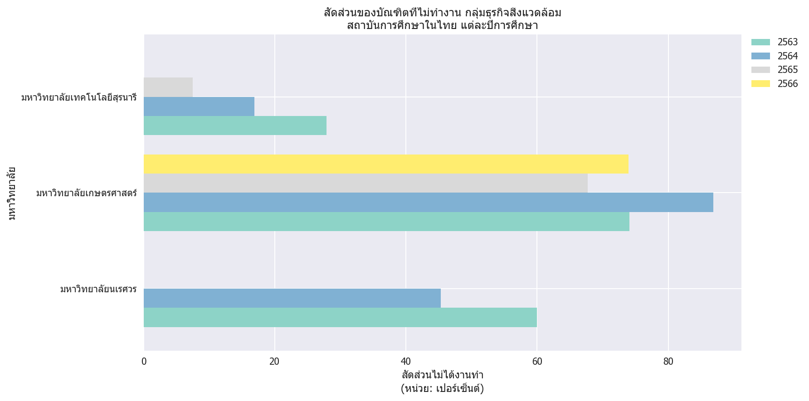<br>
      <em>กราฟที่ 3-1  แสดงการเปรียบเทียบสัดส่วนการไม่ทำงานของบัณฑิตกลุ่มธุรกิจสิ่งแวดล้อมแต่ละสถาบัน
ปีการศึกษา 2563-2566</em>
    </td>
  </tr>
</table>

---
จากการวิเคราะห์ข้อมูลในกราฟที่ 3-1 พบว่า มหาวิทยาลัยเกษตรศาสตร์มีสัดส่วนบัณฑิตที่ยังไม่สามารถเข้าสู่ตลาดแรงงานได้สูงที่สุดเมื่อเทียบกับอีกสองสถาบัน อย่างไรก็ตาม อัตราการหางานไม่ได้ของทั้งสามสถาบันยังอยู่ในระดับที่น่ากังวลและมีแนวโน้มคล้ายคลึงกัน ข้อมูลนี้สะท้อนถึงความเหลื่อมล้ำระหว่างกระแสความตื่นตัวของตลาดแรงงานโลกที่ให้ความสำคัญกับประเด็นสิ่งแวดล้อม กับการผลักดันในระดับประเทศที่ยังไม่สามารถตอบรับหรือขับเคลื่อนให้เกิดการเปลี่ยนแปลงอย่างเป็นรูปธรรมได้เท่าที่ควร

ปัจจัยที่อาจส่งผลต่อปัญหานี้ ได้แก่:
- หลักสูตรยังไม่ตอบโจทย์ทักษะเชิงปฏิบัติหรือเทคโนโลยีที่ใช้จริงในภาคอุตสาหกรรม
- ขาดการฝึกงานหรือความร่วมมือกับภาคธุรกิจในการพัฒนาทักษะเฉพาะทาง
- ความคาดหวังของนายจ้างที่เปลี่ยนไปตามเทรนด์เทคโนโลยีและความยั่งยืน

## 3.2 การเปรียบเทียบภาวะการมีงานทำระหว่างคณะภายในกลุ่มธุรกิจสิ่งแวดล้อม

<table align="center">
  <tr>
    <td align="center">
      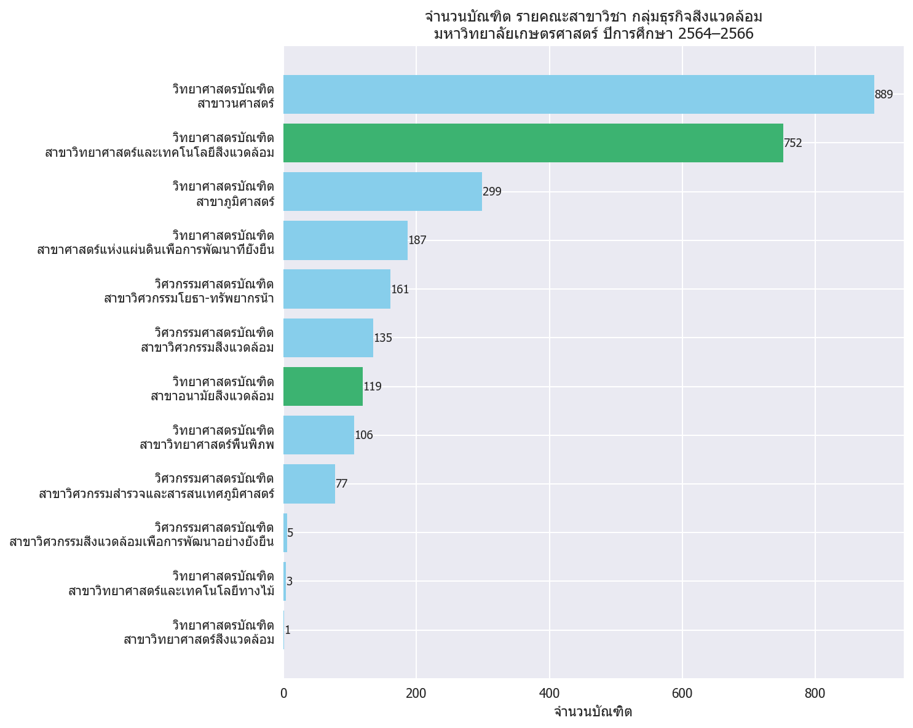<br>
      <em>กราฟที่ 3-2 แสดงการเปรียบเทียบจำนวนบัณฑิต รายคณะสาขาวิชา กลุ่มธุรกิจสิ่งแวดล้อม
มหาวิทยาลัยเกษตรศาสตร์ ปีการศึกษา 2564-2566</em>
    </td>
  </tr>
</table>

<table align="center">
  <tr>
    <td align="center">
      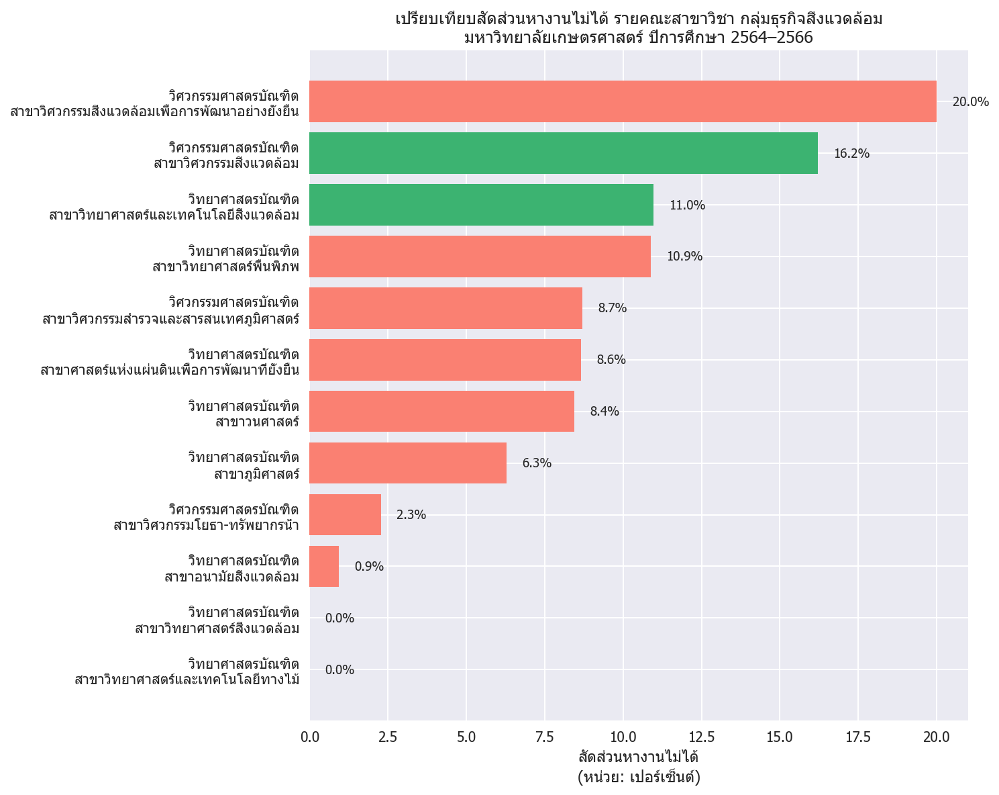<br>
      <em>กราฟที่ 3-3  แสดงการเปรียบเทียบสัดส่วนหางานไม่ได้ รายคณะสาขาวิชา กลุ่มธุรกิจสิ่งแวดล้อม
มหาวิทยาลัยเกษตรศาสตร์ ปีการศึกษา 2564-2566</em>
    </td>
  </tr>
</table>

เมื่อพิจารณาเฉพาะข้อมูลภายในกลุ่มธุรกิจสิ่งแวดล้อม พบว่าคณะวิศวกรรมสิ่งแวดล้อมมีอัตราการหางานไม่ได้อยู่ที่ 16.2% ซึ่งสูงกว่าคณะวิทยาศาสตร์สิ่งแวดล้อมที่มีอัตราการหางานไม่ได้เพียง 11% ดังแสดงในกราฟที่ 3-3 สะท้อนถึงความแตกต่างด้านความสามารถในการแข่งขันในตลาดแรงงาน แม้ว่าทั้งสองคณะจะอยู่ในกลุ่มวิชาด้านสิ่งแวดล้อมเช่นเดียวกัน

จากกราฟที่ 3-2 คณะวิทยาศาสตร์สิ่งแวดล้อมมีจำนวนบัณฑิตสำเร็จการศึกษามากกว่า และมีแนวโน้มในการเข้าสู่ตลาดแรงงานได้ดีกว่า โดยเฉพาะในตำแหน่งที่หลากหลาย เช่น นักวิเคราะห์สิ่งแวดล้อม นักวิจัย เจ้าหน้าที่ในหน่วยงานราชการ และนักกฎหมายสิ่งแวดล้อม ซึ่งล้วนเป็นตำแหน่งที่ตอบสนองต่อความต้องการด้านนโยบาย การวางแผน และการวิเคราะห์เชิงระบบที่เพิ่มขึ้นในภาครัฐและเอกชน

ในทางกลับกัน บัณฑิตจากคณะวิศวกรรมสิ่งแวดล้อมมักเข้าสู่สายงานที่เน้นด้านเทคนิคและการออกแบบระบบจัดการมลพิษ เช่น ระบบบำบัดน้ำเสียและการจัดการของเสีย ซึ่งแม้จะเป็นงานที่มีความเชี่ยวชาญเฉพาะทางและมีรายได้เฉลี่ยสูงกว่า แต่ขอบเขตของตลาดแรงงานที่รองรับยังค่อนข้างจำกัด ส่งผลให้โอกาสในการมีงานทำโดยรวมต่ำกว่าคณะวิทยาศาสตร์สิ่งแวดล้อม

ข้อมูลทั้งหมดนี้จึงสะท้อนถึงความจำเป็นในการทบทวนและปรับปรุงหลักสูตรของคณะวิศวกรรมสิ่งแวดล้อมให้สามารถตอบสนองต่อความต้องการของตลาดแรงงานได้อย่างมีประสิทธิภาพมากยิ่งขึ้น ทั้งในด้านทักษะที่หลากหลาย การบูรณาการองค์ความรู้ข้ามสาขา และการสร้างเครือข่ายกับภาคอุตสาหกรรมและหน่วยงานภาครัฐ

## ข้อเสนอแนะเชิงนโยบายและการพัฒนาหลักสูตร

  1. ปรับปรุงหลักสูตรให้สอดคล้องกับเทคโนโลยีและความต้องการของอุตสาหกรรม
     - เพิ่มเนื้อหาด้านเทคโนโลยีใหม่ เช่น IoT, AI, และระบบอัตโนมัติในการจัดการสิ่งแวดล้อม
     - ส่งเสริมการเรียนรู้แบบบูรณาการระหว่างวิศวกรรมและนโยบายสิ่งแวดล้อม
  1. สร้างความร่วมมือกับภาคธุรกิจและภาครัฐ
      - จัดโครงการฝึกงานหรือสหกิจศึกษาในองค์กรที่เกี่ยวข้องกับสิ่งแวดล้อม
      - เชิญผู้เชี่ยวชาญจากภาคอุตสาหกรรมมาร่วมออกแบบหลักสูตรหรือเป็นวิทยากรพิเศษ
  1. พัฒนาทักษะเสริมผ่านกิจกรรมนอกหลักสูตร
      - จัดอบรมหรือเวิร์กช็อปด้านการเขียนรายงานวิชาชีพ การนำเสนอผลงาน และการใช้เครื่องมือวิเคราะห์สิ่งแวดล้อม
      - สนับสนุนให้นักศึกษาเข้าร่วมการแข่งขันหรือโครงการระดับชาติ/นานาชาติ เช่น การประกวดนวัตกรรมสิ่งแวดล้อม


<a id="reference"></a>
# Reference

- Wikipedia [อันดับมหาวิทยาลัยไทย](https://th.wikipedia.org/wiki/%E0%B8%AD%E0%B8%B1%E0%B8%99%E0%B8%94%E0%B8%B1%E0%B8%9A%E0%B8%A1%E0%B8%AB%E0%B8%B2%E0%B8%A7%E0%B8%B4%E0%B8%97%E0%B8%A2%E0%B8%B2%E0%B8%A5%E0%B8%B1%E0%B8%A2%E0%B9%84%E0%B8%97%E0%B8%A2)
- แนวโน้มของตลาดแรงงาน Future of Jobs: https://rta.mi.th/the-warrior-ep21-future-of-jobs/

- งานด้านสิ่งแวดล้อมทักษะที่นายจ้างมักจะ Require เช่น 
  - การทำ Report (พวก Microsoft/Gworkspace)
  - ขับรถ
  - ต้องมีใบ กว
  - ภาษาอังกฤษ
  - อ่านแบบ เขียนแบบ (Drawing เช่น Solid work, Autocad, Sketch Up)


<a id="challenge"></a>
# Challenge

- ใช้เวลาค่อนข้างมาก ในการวิเคราะห์ข้อมูลเพื่อหา Insight จาก Dataset ที่มีอยู่ ต้องนำข้อมูลที่มีอยู่มาสรุปผลเพื่อดูกราฟในหลายมิติ เพื่อให้ได้ข้อมูล Insight ออกมา
- การหาข้อมูลเพื่อนำมาเป็นข้อมูลอ้างอิงเพิ่มเติมในการวิเคราะห์ Insight หายากและเก็บข้อมูลลำบากเนื่องจากข้อมูลบางอย่างเป็น Pdf และมีความไม่ต่อเนื่องของข้อมูล
- การออกแบบการ Grouping จัดกลุ่มธุรกิจ เพื่อให้สามารถนำมาวิเคราะห์เพื่อให้เห็นภาพชัดเจนยิ่งขึ้น 
